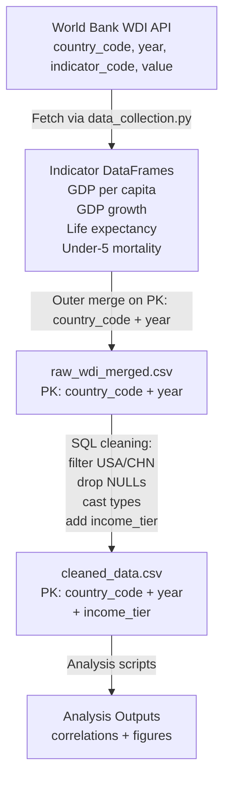

# Entity-Relationship / Data Pipeline Diagram

```mermaid
flowchart TD

A[World Bank WDI API<br/>country_code, year, indicator_code, value]

B[Indicator DataFrames<br/>GDP per capita<br/>GDP growth<br/>Life expectancy<br/>Under-5 mortality]

C[raw_wdi_merged.csv<br/>PK: country_code + year]

D[cleaned_data.csv<br/>PK: country_code + year<br/>+ income_tier]

E[Analysis Outputs<br/>correlations + figures]

A -->|Fetch via data_collection.py| B
B -->|Outer merge on PK: country_code + year| C
C -->|SQL cleaning:<br/>filter USA/CHN<br/>drop NULLs<br/>cast types<br/>add income_tier| D
D -->|Analysis scripts| E
```
