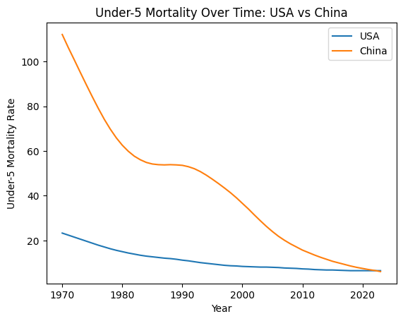
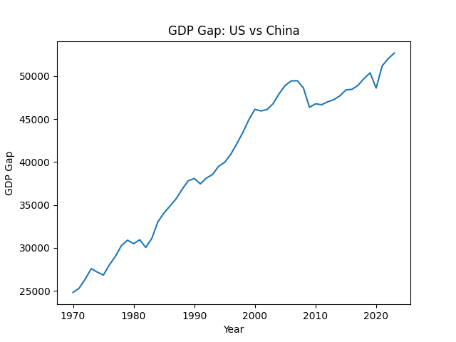
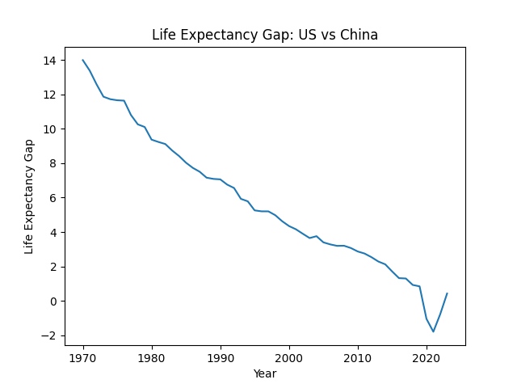
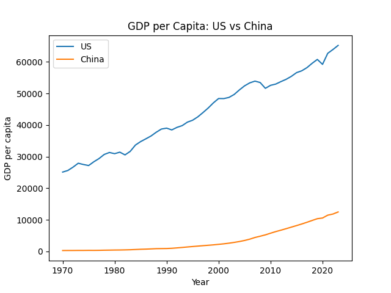

## Introduction

Economic development and population health are closely interconnected. As countries grow economically, improvements in income, infrastructure, and public services may contribute to better health outcomes. However, the extent and timing of these improvements can differ across countries depending on their stage of development.

This project examines whether improvements in economic development lead to better population health outcomes by comparing the United States and China. The United States represents a mature, high-income economy with stable growth, while China represents a rapidly developing economy that has undergone significant transformation over recent decades.

Using data from the World Bank World Development Indicators (WDI), we analyze key economic indicators (GDP per capita and GDP growth) alongside health indicators (life expectancy and under-5 mortality rate). By comparing trends over time, we aim to understand how economic development is associated with changes in population health.

The analysis is organized into several sections. First, we examine economic trends, followed by health outcomes. We then directly compare the two countries and explore the relationship between economic indicators and health outcomes.

## Data Description

This project uses data from the World Bank World Development Indicators (WDI) database, which provides standardized economic and social indicators across countries and over time. The WDI dataset covers more than 200 countries and spans from 1960 to recent years, making it suitable for analyzing long-term trends and cross-country comparisons.

We focus on two countries, the United States (USA) and China (CHN), and select four indicators that capture both economic development and population health outcomes. For economic development, we use GDP per capita (constant 2015 US$) and GDP growth (annual %). For health outcomes, we use life expectancy at birth (years) and the under-5 mortality rate (per 1,000 live births). These indicators allow us to examine how economic changes relate to improvements in population health over time.

The data was retrieved directly from the World Bank API using Python. Each indicator was initially downloaded separately and then merged into a unified dataset based on country and year. After merging, we obtained a panel-style dataset where each row represents a country-year observation and each column corresponds to one of the selected indicators.

Data cleaning was performed using SQL to ensure consistency and usability for further analysis. The cleaning process included selecting relevant columns, filtering the dataset to include only the United States and China, standardizing variable names, and converting all indicator values into numeric formats. We also checked for missing values and focused on the overlapping time period where all four indicators are available, in order to maintain comparability across variables.

The final dataset contains the following key variables: country, country_code, year, gdp_per_capita, gdp_growth, life_expectancy, and mortality_under5. Each variable is defined according to the original WDI indicator specifications, with units preserved (e.g., constant USD for GDP per capita and years for life expectancy). This cleaned dataset serves as the foundation for all subsequent analysis in the project.

## Data Analysis
This section presents the main economic, health, comparative, and relationship analyses for the United States and China. All figures were generated from the cleaned WDI dataset.

### Economic Analysis

#### GDP per Capita Trends

{fig-alt="Line plot of GDP per capita trends in the United States and China over time"}

GDP per capita in the United States remains substantially higher than in China throughout the study period, reflecting its long-established status as a high-income economy. The steady upward trend suggests sustained economic growth supported by stable institutions, advanced technology, and mature markets.

In contrast, China begins from a much lower baseline but experiences rapid and continuous increases, particularly after the 1990s. This sharp rise corresponds to major economic reforms, globalization, and industrialization, which significantly accelerated China’s economic development.

Although China has narrowed the income gap over time, a substantial difference in GDP per capita persists by the end of the period. This indicates that while developing economies can grow quickly, convergence toward high-income levels is gradual and may take decades. The observed pattern highlights different stages of economic development and suggests that absolute income levels still differ significantly despite similar growth momentum.

From a broader perspective, higher GDP per capita implies greater access to healthcare, education, and public services, which are important determinants of population health. Therefore, the persistent income gap may help explain differences in health outcomes between the two countries.

#### GDP Growth Trends

{fig-alt="Line plot of annual GDP growth rates in the United States and China over time"}

China exhibits higher and more volatile GDP growth rates compared to the United States, with several periods of rapid expansion exceeding 10%. This volatility reflects the dynamics of a rapidly developing economy undergoing structural transformation, including shifts from agriculture to industry and from industry to services.

In recent years, China’s growth rate shows a gradual decline, suggesting a transition from high-speed growth to more sustainable, moderate growth. This pattern is typical for economies as they mature and face constraints such as rising labor costs and diminishing returns to capital investment.

The United States, on the other hand, demonstrates lower but more stable growth, typically ranging between 1% and 5%. Periodic downturns, such as those observed around the 2008 financial crisis and the 2020 pandemic, highlight its sensitivity to global economic shocks. However, the overall stability reflects a resilient and diversified economic structure.

The contrast between the two countries illustrates a key economic principle: developing economies tend to grow faster but with greater volatility, while advanced economies experience slower but more stable growth. This difference has important implications for population health, as economic stability may support consistent investment in healthcare systems, while rapid growth may enable large improvements but also introduce short-term disparities.

### Health Analysis

#### Life Expectancy Trends

{fig-alt="Line plot of life expectancy trends in the United States and China over time"}

Life expectancy increased in both countries over time. The United States began at a higher level and increased gradually, although the trend becomes flatter in recent years, with a slight decline around 2020.

China began with much lower life expectancy but experienced faster improvement, especially from the 1970s through the early 2000s. By the most recent years, China’s life expectancy nearly converges with that of the United States. This suggests major improvements in population health during China’s period of economic and social development.

#### Under-5 Mortality Trends

{fig-alt="Line plot of under-5 mortality rates in the United States and China over time"}

Under-5 mortality declined in both countries. The United States began with a relatively low under-5 mortality rate and decreased gradually over time.

China began with a much higher rate but experienced a sharp decline, especially between 1970 and 2010. By 2023, China’s under-5 mortality rate becomes much closer to the level of the United States, indicating substantial improvement in child health outcomes.

### Comparison Analysis

#### GDP per Capita Gap

{fig-alt="Line plot showing the GDP per capita gap between the United States and China over time"}
The GDP per capita gap between the United States and China remains large but has gradually decreased over time. China’s rapid economic growth has allowed it to narrow the gap, although the United States continues to maintain a substantial income advantage.
This result suggests partial economic convergence, but not full convergence.

#### Life Expectancy Gap

{fig-alt="Line plot showing the life expectancy gap between the United States and China over time"}
The life expectancy gap between the United States and China has steadily declined. China’s improvements in population health have allowed it to nearly close the gap with the United States.
This suggests that health outcomes can converge faster than income levels during development.

#### Direct GDP Comparison

{fig-alt="Line plot directly comparing GDP per capita in the United States and China over time"}
The direct comparison highlights clear structural differences between the two countries. The United States maintains stable and consistently high income levels, while China shows rapid growth and a steep upward trajectory.
This reflects the contrast between a mature high-income economy and a developing economy undergoing rapid transformation.
