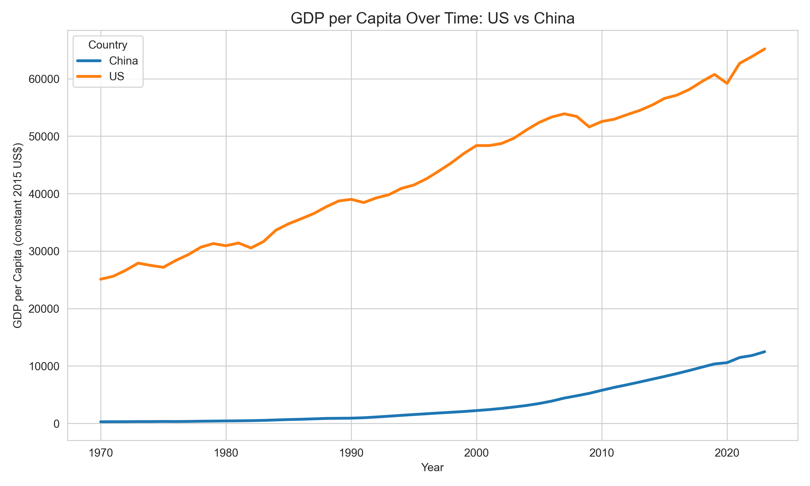
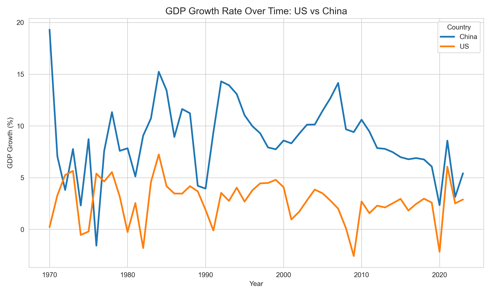
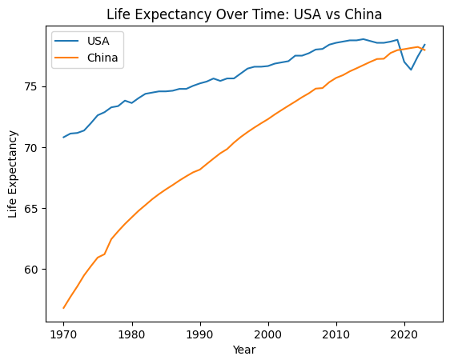
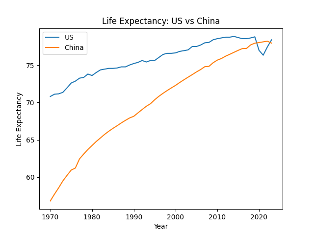
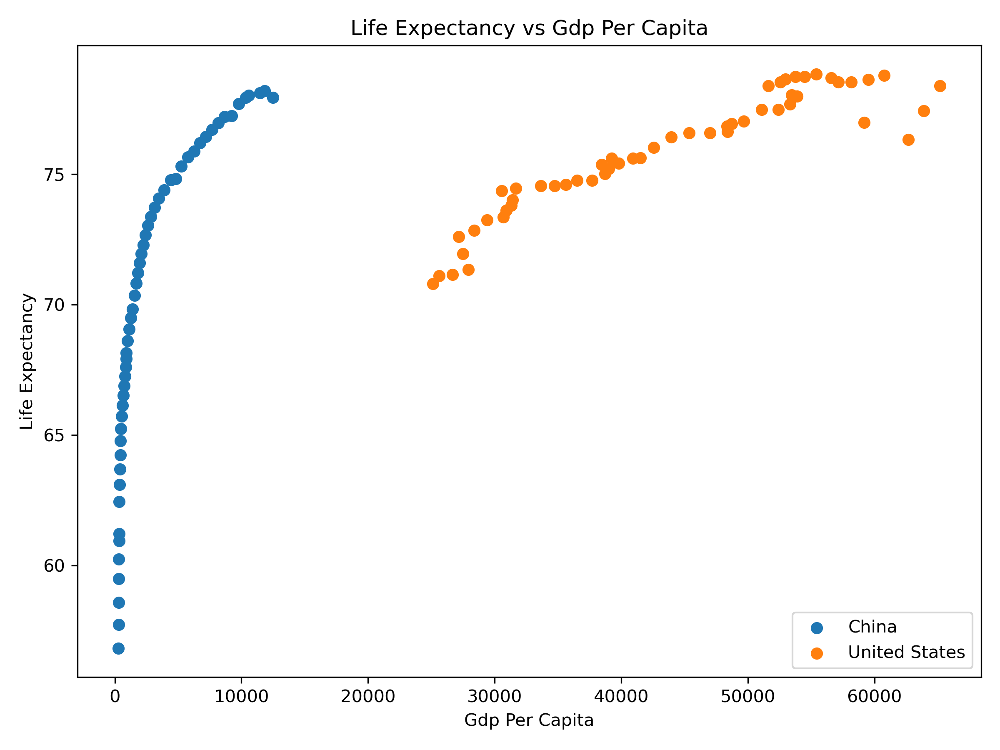
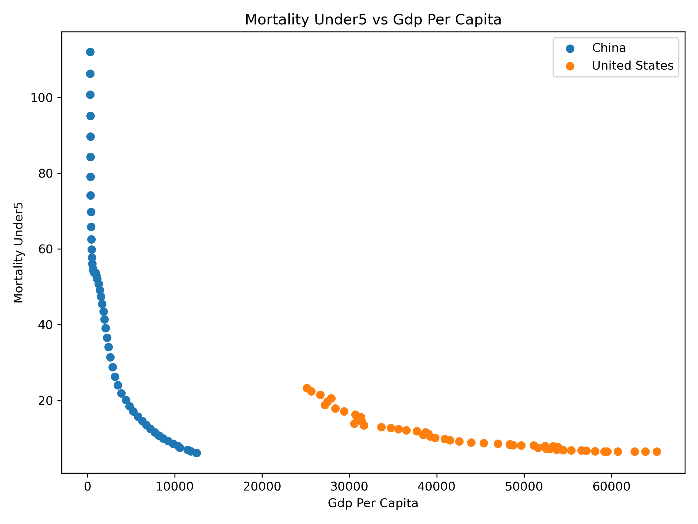
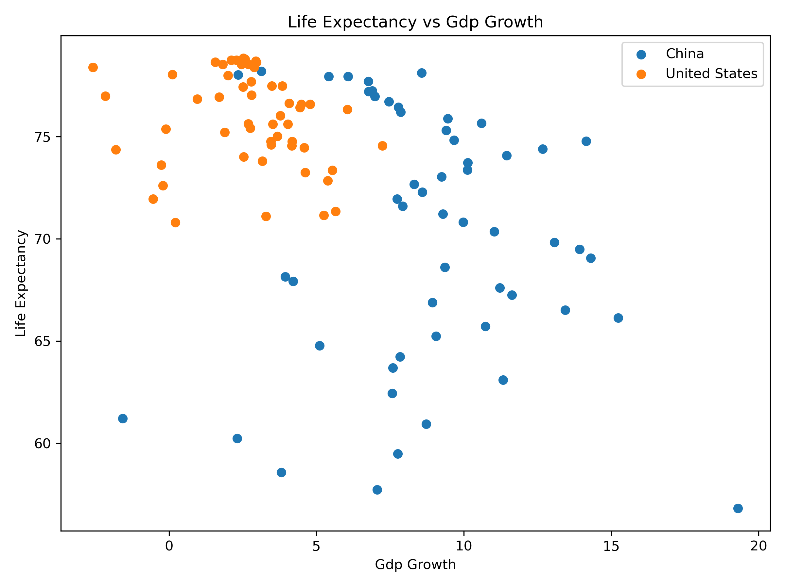
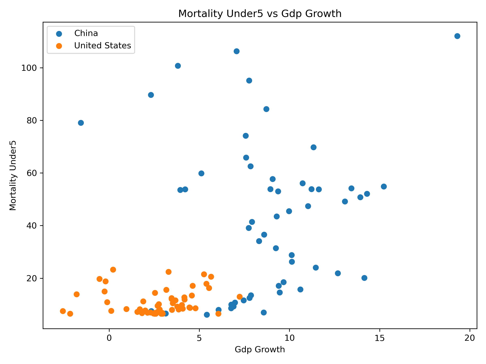

## Introduction

Economic development and population health are closely interconnected. As countries grow economically, improvements in income, infrastructure, and public services may contribute to better health outcomes. However, the extent and timing of these improvements can differ across countries depending on their stage of development.

This project examines whether improvements in economic development lead to better population health outcomes by comparing the United States and China. The United States represents a mature, high-income economy with stable growth, while China represents a rapidly developing economy that has undergone significant transformation over recent decades.

Using data from the World Bank World Development Indicators (WDI), we analyze key economic indicators (GDP per capita and GDP growth) alongside health indicators (life expectancy and under-5 mortality rate). By comparing trends over time, we aim to understand how economic development is associated with changes in population health.

The analysis is organized into several sections. First, we examine economic trends, followed by health outcomes. We then directly compare the two countries and explore the relationship between economic indicators and health outcomes.

## Data Description

This project uses data from the World Bank World Development Indicators (WDI) database, which provides standardized economic and social indicators across countries and over time. The WDI dataset covers more than 200 countries and spans from 1960 to recent years, making it suitable for analyzing long-term trends and cross-country comparisons.

We focus on two countries, the United States (USA) and China (CHN), and select four indicators that capture both economic development and population health outcomes. For economic development, we use GDP per capita (constant 2015 US$) and GDP growth (annual %). For health outcomes, we use life expectancy at birth (years) and the under-5 mortality rate (per 1,000 live births). These indicators allow us to examine how economic changes relate to improvements in population health over time.

The data was retrieved directly from the World Bank API using Python. Each indicator was initially downloaded separately and then merged into a unified dataset based on country and year. After merging, we obtained a panel-style dataset where each row represents a country-year observation and each column corresponds to one of the selected indicators.

Data cleaning was performed using SQL to ensure consistency and usability for further analysis. The cleaning process included selecting relevant columns, filtering the dataset to include only the United States and China, standardizing variable names, and converting all indicator values into numeric formats. We also checked for missing values and focused on the overlapping time period where all four indicators are available, in order to maintain comparability across variables.

The final dataset contains the following key variables: country, country_code, year, gdp_per_capita, gdp_growth, life_expectancy, and mortality_under5. Each variable is defined according to the original WDI indicator specifications, with units preserved (e.g., constant USD for GDP per capita and years for life expectancy). This cleaned dataset serves as the foundation for all subsequent analysis in the project.

## Data Analysis

This section presents four parts of the analysis. First, the economic analysis compares GDP per capita and GDP growth trends. Second, the health analysis compares life expectancy and under-5 mortality. Third, the comparison analysis examines cross-country gaps over time. Finally, the relationship analysis explores whether economic indicators are associated with health outcomes.

### Summary Statistics

```{python}
#| echo: false

import pandas as pd

df = pd.read_csv("data/processed/cleaned_data.csv")

df = df[df["country"].isin(["United States", "China"])]

summary = df.groupby("country")[["gdp_per_capita", "gdp_growth", "life_expectancy", "mortality_under5"]].mean().round(2)

summary
```

The table summarizes average economic and health indicators for the United States and China over the study period. The United States has a substantially higher average GDP per capita, while China exhibits a higher average GDP growth rate. In terms of health outcomes, China has made significant progress, with increases in life expectancy and reductions in under-5 mortality, narrowing the gap with the United States.

### Economic Analysis

#### GDP per Capita Trends

{fig-alt="Line plot of GDP per capita trends in the United States and China over time"}

GDP per capita in the United States remains substantially higher than in China throughout the study period, reflecting its long-established status as a high-income economy. The steady upward trend suggests sustained economic growth supported by stable institutions, advanced technology, and mature markets.

In contrast, China begins from a much lower baseline but experiences rapid and continuous increases, particularly after the 1990s. This sharp rise corresponds to major economic reforms, globalization, and industrialization, which significantly accelerated China’s economic development.

Although China has narrowed the income gap over time, a substantial difference in GDP per capita persists by the end of the period. This indicates that while developing economies can grow quickly, convergence toward high-income levels is gradual and may take decades. The observed pattern highlights different stages of economic development and suggests that absolute income levels still differ significantly despite similar growth momentum.

From a broader perspective, higher GDP per capita implies greater access to healthcare, education, and public services, which are important determinants of population health. Therefore, the persistent income gap may help explain differences in health outcomes between the two countries.


#### GDP Growth Trends

{fig-alt="Line plot of annual GDP growth rates in the United States and China over time"}

China exhibits higher and more volatile GDP growth rates compared to the United States, with several periods of rapid expansion exceeding 10%. This volatility reflects the dynamics of a rapidly developing economy undergoing structural transformation, including shifts from agriculture to industry and from industry to services.

In recent years, China’s growth rate shows a gradual decline, suggesting a transition from high-speed growth to more sustainable, moderate growth. This pattern is typical for economies as they mature and face constraints such as rising labor costs and diminishing returns to capital investment.

The United States, on the other hand, demonstrates lower but more stable growth, typically ranging between 1% and 5%. Periodic downturns, such as those observed around the 2008 financial crisis and the 2020 pandemic, highlight its sensitivity to global economic shocks. However, the overall stability reflects a resilient and diversified economic structure.

The contrast between the two countries illustrates a key economic principle: developing economies tend to grow faster but with greater volatility, while advanced economies experience slower but more stable growth. This difference has important implications for population health, as economic stability may support consistent investment in healthcare systems, while rapid growth may enable large improvements but also introduce short-term disparities.

### Health Analysis

This section focuses on two population health indicators: life expectancy at birth and under-5 mortality rate. These variables are useful because they capture different dimensions of population health. Life expectancy reflects overall survival and long-term health conditions, while under-5 mortality is closely related to child health, healthcare access, nutrition, and public health infrastructure.

#### Life Expectancy Trends

{fig-alt="Line plot of life expectancy trends in the United States and China over time"}

Life expectancy increased in both the United States and China from 1970 to 2023. The United States began at a higher level and increased gradually over time. However, the U.S. trend becomes flatter in recent years, with a visible decline around 2020.

China began with a much lower life expectancy but experienced faster improvement across the study period. The increase is especially clear from the 1970s through the early 2000s. By the most recent years, China’s life expectancy nearly converges with that of the United States.

This trend suggests that China experienced major improvements in population health during a period of rapid economic and social development. It also shows that the health gap between the two countries narrowed substantially, even though the economic gap remained large.

#### Under-5 Mortality Trends

{fig-alt="Line plot of under-5 mortality rates in the United States and China over time"}

Under-5 mortality declined in both countries over time. The United States began with a relatively low under-5 mortality rate and continued to decrease gradually.

China began with a much higher under-5 mortality rate but experienced a sharp decline, especially between 1970 and 2010. By 2023, China’s under-5 mortality rate becomes much closer to the level of the United States.

This pattern indicates substantial improvement in child health outcomes in China. The sharp decline may reflect improvements in living conditions, access to healthcare, nutrition, sanitation, and public health systems. Overall, the health analysis shows that population health outcomes in China improved quickly from a lower starting point, leading to strong convergence with the United States.

### Comparison Analysis

#### GDP per Capita Gap

{fig-alt="Line plot showing the GDP per capita gap between the United States and China over time"}
The GDP per capita gap between the United States and China remains large but has gradually decreased over time. China’s rapid economic growth has allowed it to narrow the gap, although the United States continues to maintain a substantial income advantage.
This result suggests partial economic convergence, but not full convergence.

#### Life Expectancy Gap

{fig-alt="Line plot showing the life expectancy gap between the United States and China over time"}
The life expectancy gap between the United States and China has steadily declined. China’s improvements in population health have allowed it to nearly close the gap with the United States.
This suggests that health outcomes can converge faster than income levels during development.

#### Direct GDP Comparison

{fig-alt="Line plot directly comparing GDP per capita in the United States and China over time"}
The direct comparison highlights clear structural differences between the two countries. The United States maintains stable and consistently high income levels, while China shows rapid growth and a steep upward trajectory.
This reflects the contrast between a mature high-income economy and a developing economy undergoing rapid transformation.

#### Life Expectancy Comparison

{fig-alt="Line plot directly comparing life expectancy in the United States and China over time"}

The direct comparison of life expectancy shows a clear convergence pattern between the United States and China. While the United States initially had a higher life expectancy, China has experienced steady and continuous improvements over time.

This reinforces the gap analysis, indicating that differences in population health between the two countries have narrowed significantly. Compared to GDP, life expectancy demonstrates a more consistent and faster convergence process.

### Relationship Analysis

#### Objective

This section examines whether economic development indicators are associated with population health outcomes in the United States and China.

#### GDP per Capita and Life Expectancy

{fig-alt="Scatter plot comparing GDP per capita and life expectancy"}

GDP per capita is positively associated with life expectancy. As GDP per capita increases, life expectancy generally rises. 
This relationship is especially visible for China, where rapid increases in GDP per capita are linked with large improvements in life expectancy.

#### GDP per Capita and Under-5 Mortality

{fig-alt="Scatter plot comparing GDP per capita and under-5 mortality"}

GDP per capita is negatively associated with under-5 mortality. Countries and years with higher GDP per capita tend to have lower child mortality rates.
This relationship suggests that long-term economic development is linked to improved child health outcomes.

#### GDP Growth and Life Expectancy

{fig-alt="Scatter plot comparing GDP growth and life expectancy"}

GDP growth rate shows a weaker and less consistent relationship with life expectancy than GDP per capita. 
This suggests that short-term annual economic growth is not as directly connected to health outcomes as long-term income level.

#### GDP Growth and Under-5 Mortality

{fig-alt="Scatter plot comparing GDP growth and under-5 mortality"}

GDP growth rate also shows a weaker relationship with under-5 mortality. 
While economic growth may contribute to better health over time, annual growth fluctuations do not consistently predict immediate changes in child mortality.
Overall, the relationship analysis suggests that GDP per capita is more closely related to population health than short-term GDP growth.

## Results and Discussion

### Economic gaps remain large

The comparison between the United States and China reveals that economic and health indicators do not converge at the same pace. Over the past several decades, China has experienced rapid economic growth, reflected in both its high GDP growth rates and the substantial increase in GDP per capita. Although the gap in GDP per capita between the two countries has narrowed significantly, it remains large. The United States continues to maintain a much higher income level, indicating that while China is catching up, full economic convergence has not yet been achieved.

Examining GDP growth trends provides further insight into the development patterns of the two countries. China exhibits consistently higher but more volatile growth rates, especially during the 1980s through the early 2000s, reflecting a period of rapid industrialization and economic reform. In contrast, the United States shows lower but more stable growth, typically within a narrower range. Periods of economic downturn, such as the 2008 financial crisis and the 2020 COVID-19 pandemic, are more clearly visible in the U.S. data, highlighting differences in economic structure and resilience between a mature and a developing economy.

### Health outcomes converge faster than income
In terms of health outcomes, a different pattern emerges. China shows strong improvement in key health indicators, including rising life expectancy and sharply declining under-5 mortality rates. These trends suggest that population health in China has improved at a faster pace than income growth alone would predict. Meanwhile, the United States starts from a higher baseline and shows more gradual improvements over time. The faster convergence in health outcomes compared to income suggests that health improvements can occur even when economic gaps persist.The health results are especially important for answering the main research question. If economic development translated into health outcomes only through income level, we would expect the health gap to remain large as long as the GDP per capita gap remained large. Instead, life expectancy and under-5 mortality show much faster convergence. This suggests that population health can improve through broader development processes, including public health investment, healthcare access, education, sanitation, and nutrition, not only through individual income growth.

### Relationship between economic development and health

The relationship analysis between economic and health indicators further supports these observations. GDP per capita appears to have a strong and consistent association with better health outcomes. Higher income levels are linked to longer life expectancy and lower child mortality, likely due to improved access to healthcare, better nutrition, and enhanced living conditions. On the other hand, GDP growth rates do not show a similarly strong or stable relationship with health indicators. This suggests that short-term economic fluctuations are less important than sustained long-term development in shaping population health.

These findings imply that economic development contributes to health improvements primarily through structural and long-term changes rather than temporary increases in growth. Investments in infrastructure, education, and healthcare systems—often associated with rising income levels—play a critical role in improving population health. The contrast between the United States and China highlights how different development stages influence both economic dynamics and health outcomes.

### Limitations

However, several limitations should be considered when interpreting these results. First, this analysis focuses on only two countries, which limits the generalizability of the findings. Other countries may exhibit different patterns depending on their economic structure, policy environment, and social conditions. Second, the analysis is based on observational data and identifies correlations rather than causal relationships. It is therefore not possible to conclude that economic growth directly causes improvements in health outcomes.

In addition, important variables that may influence health outcomes are not explicitly included in this analysis. Factors such as healthcare access, public health policy, environmental quality, education levels, and demographic changes (such as aging populations) can all play significant roles. Data limitations, including potential measurement errors or differences in reporting standards across countries, may also affect the results.

### Overall interpretation

Overall, while the findings provide strong evidence of a relationship between economic development and population health, they also highlight the complexity of this relationship. Future research could extend this analysis by including more countries, incorporating additional variables, and applying causal inference methods to better understand the mechanisms linking economic and health outcomes.

## Conclusion

This project analyzes the relationship between economic development and population health outcomes by comparing the United States and China over time.

The results show clear differences in economic patterns. The United States maintains consistently high income levels with relatively stable growth, while China experiences rapid economic expansion, gradually narrowing the income gap. However, despite this progress, a substantial difference in GDP per capita remains.

In contrast, health outcomes show stronger convergence. Life expectancy in China has increased significantly and is now close to that of the United States, while under-5 mortality has declined sharply. These findings suggest that improvements in population health can occur more rapidly than increases in income.

The relationship analysis further supports this conclusion. GDP per capita is strongly associated with better health outcomes, including higher life expectancy and lower child mortality. However, short-term GDP growth appears to have a weaker and less consistent relationship with health indicators.

Overall, the results indicate that long-term economic development plays an important role in improving population health, but the relationship is not uniform across all indicators. Health improvements may occur faster due to targeted policies, public health investments, and social development. At the same time, because this project uses descriptive trends and correlations, the results should be interpreted as evidence of association rather than proof of direct causation.

These findings highlight the importance of considering multiple dimensions of development when evaluating progress across countries.


